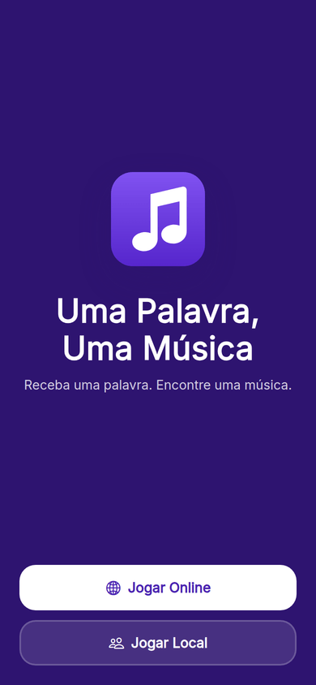
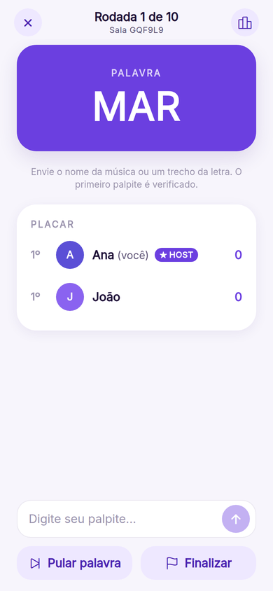
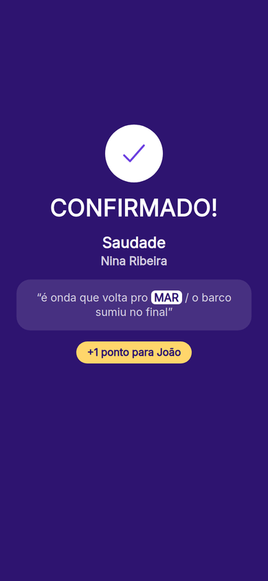
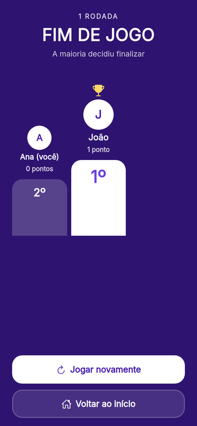

# Uma Palavra, Uma Música

Jogo musical para celular: todos recebem uma **palavra** e precisam lembrar de uma **música** que tenha
essa palavra. Dá para jogar **online** (cada pessoa no seu aparelho, até 10 por sala) ou **local** (todos
em volta do mesmo aparelho).

<p>
  
  
  
  
</p>

- **Modo online:** sala com código, lobby, entrada durante a partida, verificação automática da música
  (Musixmatch, pelo servidor), “primeiro palpite vale”, votação *Novo palpite × Nova palavra*, pedido
  coletivo de finalização por maioria, transferência automática de host, reconexão e pódio animado.
- **Modo local:** jogadores no mesmo aparelho, marcação de quem acertou, pular palavra e pódio.
- **Regra central:** uma palavra só vira **rodada** quando recebe pelo menos um palpite verificado.
  Palavra pulada sem tentativa não conta; palavra com tentativa conta uma única vez.

O app é independente de Base44/Lovable e não depende de créditos de IA: a IA é uma segunda camada
**opcional** para casos ambíguos.

## Tecnologia

| Parte | Tecnologia |
| --- | --- |
| App (iOS, Android e web) | React Native + Expo SDK 57, Expo Router, Reanimated, TypeScript |
| Backend | Supabase: Postgres (regras do jogo em funções RPC), Realtime, Auth anônimo, Edge Functions |
| Música | `MusicSearchService` com provedor Musixmatch (substituível) e IA opcional (Claude) |
| Testes | Vitest (lógica e busca musical), Node test + Postgres (regras online), `deno check` |

## Começando

```bash
npm install
npx expo start          # abra no Expo Go (celular), no simulador ou pressione "w" para web
```

O **modo local funciona imediatamente**. Para o **modo online**, crie um projeto Supabase e siga
[docs/CONFIGURACAO.md](docs/CONFIGURACAO.md) (migrações, função `submit-guess`, chave do Musixmatch e o
arquivo `.env` do app).

## Estrutura

```text
src/
  app/          rotas (Expo Router) — arquivos finos que apontam para screens/
  screens/      telas: início, modo local, modo online (lobby, partida, pódio)
  components/   botões, cartões, cabeçalho, contador, jogador, palavra, placar, pódio, modais…
  animations/   presets de animação, toque com escala, pulso
  hooks/        useOnlineRoom (sincronização), useLocalGame, useCountdown, useToast
  services/     Supabase, API online, Realtime, armazenamento, haptics, diálogos
  game/local/   máquina de estados do modo local (reducer puro + testes)
  data/         banco de palavras (words.pt-BR.json)
  theme/        cores, tipografia e espaçamentos
  types/ utils/
supabase/
  migrations/   tabelas, RLS e as regras do jogo (funções RPC)
  functions/    Edge Function submit-guess + MusicSearchService (_shared/music)
  tests/        testes de integração das regras online (Postgres)
docs/           arquitetura, configuração/publicação e testes
```

## Scripts

| Comando | O que faz |
| --- | --- |
| `npm start` | Servidor de desenvolvimento do Expo |
| `npm test` | Testes de lógica: modo local, ranking, normalização, busca musical |
| `npm run test:db` | Regras do modo online num Postgres real (ver [docs/TESTES.md](docs/TESTES.md)) |
| `npm run check:functions` | Checagem de tipos da Edge Function (Deno) |
| `npm run typecheck` / `npm run lint` | TypeScript e ESLint |
| `npm run words:sql` | Gera o SQL do banco de palavras a partir do JSON |
| `npm run icons` | Gera os ícones PNG a partir do desenho vetorial |

## Documentação

- [Arquitetura e regras do jogo](docs/ARQUITETURA.md) — máquina de estados, contagem de rodadas,
  concorrência, reconexão, segurança e verificação musical.
- [Configuração e publicação](docs/CONFIGURACAO.md) — Supabase, Musixmatch, IA opcional, builds com EAS.
- [Testes](docs/TESTES.md) — como rodar e o que cada suíte cobre (lista obrigatória da especificação).
