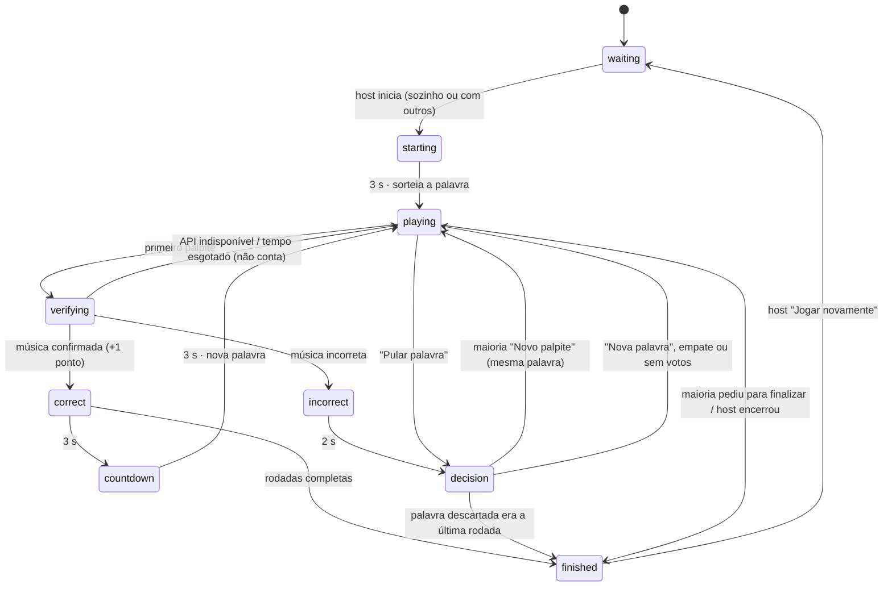

# Arquitetura

```text
App (React Native + Expo)
  │  login anônimo · RPCs · Realtime · Edge Function
  ▼
Supabase
  ├── Postgres ── tabelas + RLS + regras do jogo em funções RPC (fonte oficial do estado)
  ├── Realtime ── avisa os aparelhos quando a sala muda
  ├── Auth ────── identidade anônima e estável por aparelho (reconexão sem duplicar jogador)
  └── Edge Function submit-guess
        └── MusicSearchService ── MusixmatchProvider (chave só no servidor)
                               └─ (opcional) IA para desempate entre candidatos reais
```

O aplicativo publicado **não depende do Claude Code** nem de plataformas como Base44/Lovable: é um app
Expo comum + um projeto Supabase.

## Quem decide o quê

O aparelho só exibe. Todas as decisões oficiais acontecem no Postgres, dentro de funções
`security definer` que validam o jogador (`auth.uid()`), a sala, a fase e o prazo:

| Decisão | Onde |
| --- | --- |
| Quem enviou primeiro | `submit_guess` (trava a linha da sala com `select … for update`) |
| Quem acertou / ponto | `resolve_guess` (só a Edge Function, com `service_role`) |
| Palavra sorteada, sem repetição | `app_private.draw_word` + índice único em `used_words` |
| Quem é host | `app_private.ensure_host` (menor `join_order` entre os ativos) |
| Maioria para finalizar | `app_private.check_finish_majority` (> 50% dos ativos) |
| Resultado da votação | `app_private.resolve_decision` |
| Fim da partida | `app_private.finish_room` |

Os clientes não têm permissão de `insert/update/delete` em nenhuma tabela (RLS sem políticas de
escrita + `revoke`). Leitura só para membros da sala (`app_private.is_room_member`). O banco de palavras
não é legível pelo app.

## Máquina de estados (`rooms.status`)



Cada fase temporizada grava `phase_ends_at`. Quando o prazo vence, qualquer aparelho chama
`advance_room`; o servidor confere o relógio **dele** e avança. A chamada é idempotente (vários
aparelhos podem chamar juntos) e também acontece dentro do `heartbeat`, então a partida não trava se
alguém fechar o app. As contagens na tela usam a diferença de relógio medida em cada leitura do estado.

| Fase | Duração |
| --- | --- |
| `starting` (“Preparem-se!”) | 3 s |
| `verifying` | até a resposta da API (mínimo 1,5 s na tela; expira em 25 s) |
| `correct` (“CONFIRMADO!”) | 3 s |
| `countdown` (“Próxima palavra em 3, 2, 1”) | 3 s |
| `incorrect` (“MÚSICA INCORRETA”) | 2 s |
| `decision` (Novo palpite × Nova palavra) | 3 s |

## Palavra exibida × rodada contabilizada

- Cada palavra sorteada é uma linha em `rounds` (`sequence` = ordem de exibição).
- `round_number` fica **nulo** até o primeiro palpite **verificado** (correto ou incorreto). Nesse momento,
  `app_private.count_attempt` atribui o próximo número e incrementa `rooms.rounds_played` — uma única vez
  por palavra (`unique (room_id, round_number)` e a checagem `has_attempt`).
- Falha da API musical **não** conta: o palpite fica com `status = 'error'` e o jogo volta a aceitar palpites.
- A tela mostra “Rodada X de N” com `X = round_number` da palavra atual ou `rounds_played + 1`.
- A partida termina quando uma palavra se encerra (acerto ou descarte) com `rounds_played ≥ configured_rounds`.

## Palpites e concorrência

1. O app chama a Edge Function `submit-guess` com o token da sessão.
2. A função valida o usuário (`auth.getUser`) e chama `submit_guess(user, sala, texto)`.
3. `submit_guess` trava a sala. Se o estado não for `playing`, o palpite é descartado (`busy`). Se for,
   grava o palpite, muda para `verifying` e libera a trava — quem chegar depois já vê `verifying`.
4. A função responde na hora e, em segundo plano (`EdgeRuntime.waitUntil`), verifica a música e grava o
   resultado com `resolve_guess`. Todos os aparelhos acompanham pelo Realtime.

Além da trava, o banco garante no máximo **um palpite em verificação por sala** e **um palpite correto
por palavra** (índices únicos parciais).

## Votação e finalização

- **Votação** (`round_votes`): um voto por jogador e por janela (`decision_number`), pode mudar até o
  prazo; votos depois do prazo são recusados. Maioria em “Novo palpite” mantém a palavra; “Nova palavra”,
  empate ou nenhum voto sorteiam outra. “Pular palavra” abre a mesma votação, já com o voto de quem pediu.
- **Finalizar** (`finish_requests`): não existe “Não”. Cada clique soma um pedido; quando os pedidos de
  jogadores **ativos** passam de 50% dos ativos, a partida termina para todos. A maioria é recalculada
  quando alguém sai ou cai.
- **Última rodada:** quando `rounds_played ≥ configured_rounds − 1`, o host vê o aviso “O jogo está indo
  para a última rodada. Deseja adicionar mais?”. NÃO grava `final_prompt_answered_for`; SIM soma rodadas
  (sem limite baixo artificial; limite técnico de 9.999).

## Conexão, reconexão e host

- **Identidade:** login anônimo do Supabase, salvo no aparelho. `players` tem `unique (room_id, user_id)`,
  então reabrir o app ou recarregar a página recupera o **mesmo** jogador com os mesmos pontos.
- **Sinal de vida:** `heartbeat` a cada 5 s. Sem sinal por 30 s, o jogador fica inativo (`left_reason =
  'timeout'`), mas continua no placar. Ao voltar, o próprio `heartbeat` o reativa.
- **Recuperação:** o app recarrega o estado a cada evento do Realtime, ao reconectar o canal, ao voltar do
  segundo plano e sempre que o `heartbeat` indica uma versão (`state_version`) diferente.
- **Host:** se o host sai ou cai de vez, o cargo passa para o jogador ativo com menor `join_order`
  (ordem de entrada guardada no banco). Quem sai por conta própria e volta entra no fim da fila;
  quem só perdeu a conexão mantém a posição. O host pode iniciar, expulsar, adicionar rodadas,
  encerrar e reiniciar a sala.

## Verificação musical

`supabase/functions/_shared/music/`:

```text
MusicSearchService.verify({ guess, targetWord })
  1. Busca candidatos na fonte: por título, por letra (palpites com 3+ palavras) e geral.
  2. Avalia em ordem cada candidato (sem repetir música):
       - correspondência do palpite com o título (inclui "título + artista" e partes do título),
         com a letra (trecho) ou com "título + trecho";
       - presença da palavra sorteada no título ou na letra (aceita plurais simples: corações).
  3. Usa a PRIMEIRA correspondência válida (não o primeiro resultado bruto).
  4. Só possibilidades parciais? Se a IA estiver habilitada, ela escolhe entre os candidatos reais
     (índice ou "nenhum"). Sem IA, o palpite é incorreto.
  → { found, title, artist, matchedExcerpt, matchedWord, confidence, … }
```

- **Normalização** (`text.ts`): ignora acentos, caixa, pontuação e espaços; tolera 1–2 letras erradas em
  palavras longas. O texto original nunca é alterado.
- **Trocar de fonte:** implemente `MusicProvider` (busca + letra) e escolha-o em `factory.ts`.
- **Musixmatch:** no plano gratuito a letra vem incompleta (~30%). Quando a palavra não está no trecho
  recebido, o provedor confirma pela busca `q_lyrics` do próprio Musixmatch (que considera a letra toda).
- **Erros técnicos** ficam só nos logs; o jogador vê “Não conseguimos verificar a música agora”.

## Dados (equivalência com a especificação)

| Especificação | Implementação |
| --- | --- |
| `rooms.host_id` | `rooms.host_player_id` |
| `rooms.current_round` | `rooms.rounds_played` (rodadas contabilizadas) + `current_word_id` |
| `rooms.status` | `rooms.status` (máquina de estados acima) + `phase_ends_at` |
| `players.*` | igual, com `user_id`, `last_seen_at` e `left_reason` |
| `rounds.*` | igual; `round_number` só é preenchido quando a palavra conta como rodada |
| `guesses.*` | igual, com `failure_reason`, `matched_word`, `confidence`, `provider` |
| `round_votes.*` | igual, com `decision_number` (uma votação por janela) |
| `finish_requests.*`, `used_words.*` | iguais |
| — | `words`: banco de palavras editável pelo painel do Supabase |

## Modo local

Sem servidor: `src/game/local/reducer.ts` é uma máquina de estados pura (`setup → playing ⇄
celebrating → finished`) com as mesmas regras de contagem de rodadas (“Tentativa errada” registra uma
tentativa; pular sem tentativa não conta). O estado é salvo no aparelho para continuar depois.

## Modo online dentro do Claude

Quando a versão web é aberta como artefato no Claude (`window.claude` existe), o app usa outro
backend com a **mesma interface** (`src/services/online/types.ts`), escolhido em
`src/services/onlineApi.ts`:

```text
App (web, dentro do Claude)
  ├── db ──── rooms/<CÓDIGO> (estado da sala) · rooms/<CÓDIGO>/votes/<jogador> (voto de cada um)
  ├── room ── presença na sala "upum-<código>" (quem está conectado)
  ├── user ── id estável de cada pessoa (reconexão sem duplicar jogador)
  └── sample ─ verificação da música pelo Claude, na conta de quem palpitou
```

- **Regras:** `src/game/online/rules.ts` é a mesma máquina de estados das funções SQL, em TypeScript puro
  e com testes (`rules.test.ts`). Ao mudar uma regra online, mude os dois lados.
- **Quem decide:** não há servidor. Toda alteração da sala acontece com uma trava curta no documento
  (`acquire`): o aparelho trava, lê, aplica a regra e grava. Dois palpites simultâneos viram fila e só o
  primeiro é aceito, como no `select … for update` do Postgres.
- **Relógio:** os prazos (3 s etc.) usam um relógio compartilhado estimado pelo horário do servidor que
  vem na trava (`SharedClock`), então aparelhos com relógios diferentes veem os mesmos prazos.
- **Juiz:** o jogador ativo mais antigo que está presente (normalmente o host) avança os prazos e marca
  como desconectado quem sumiu da presença por 30 s. Se ele cair, os demais assumem depois de 1,5 s.
- **Verificação:** `src/services/online/claudeJudge.ts`. Só vale se o jogo souber **de qual música** é o palpite
  (título e artista), para ninguém inventar música. São duas perguntas ao Claude (modelo mais capaz):
  1. identificar: de quais músicas reais o palpite pode ser e o que o jogador disse ser título/artista;
     se o jogador disse o título, é essa música que será conferida;
  2. conferir: uma pergunta separada só sobre a música escolhida (existe? o palpite é dela? tem a palavra?).
  Sem música identificada, ou sem as duas respostas positivas, o palpite não vale. O Claude não devolve trechos
  de letra: o trecho exibido é o que o jogador digitou. Falha ou recusa de permissão devolve `error`: o palpite
  não conta e o jogo volta a aceitar palpites. Limite: sem internet no artefato, o Claude responde de memória e
  pode não reconhecer músicas pouco conhecidas; uma base de letras exige o backend com servidor.
- **Acesso:** só quem pode gravar no artefato joga online (dono e convidados com edição; em planos de
  equipe, membros com acesso de colaborador). Quem só visualiza vê um aviso e pode jogar no modo local.
